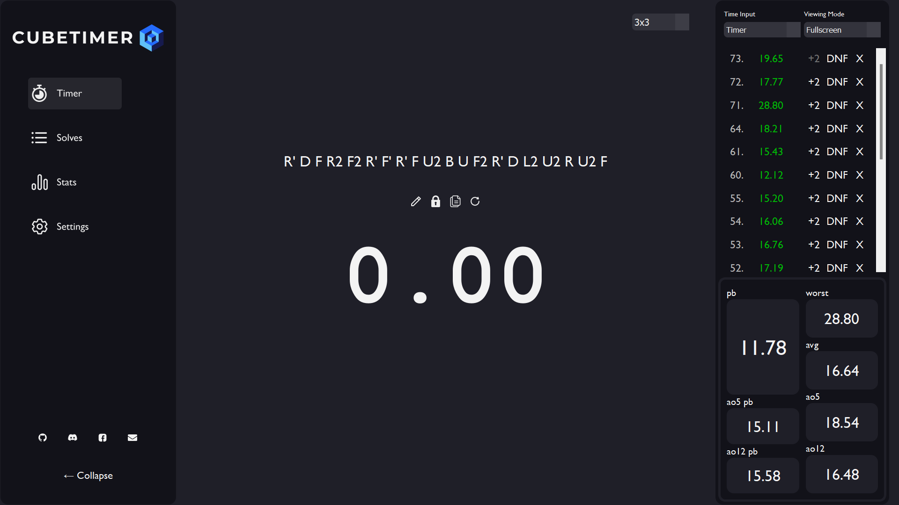

# Cube Timer

Cube Timer is a PyQt5-based application for timing and managing Rubik's Cube solves. It provides features such as recording solve times, displaying recent times, and calculating averages of solves.

## Features

- **Stopwatch**: Start and stop the timer using the spacebar.
- **Recent Times Display**: View a list of recent solve times.
- **Time Info Box**: View and edit details of individual solves.
- **Statistics Display**: View personal bests, averages, and other statistics.
- **Scramble Input**: Input and display scrambles for each solve.
- **Custom Input**: Use manual input or the stopwatch for saving times

___

